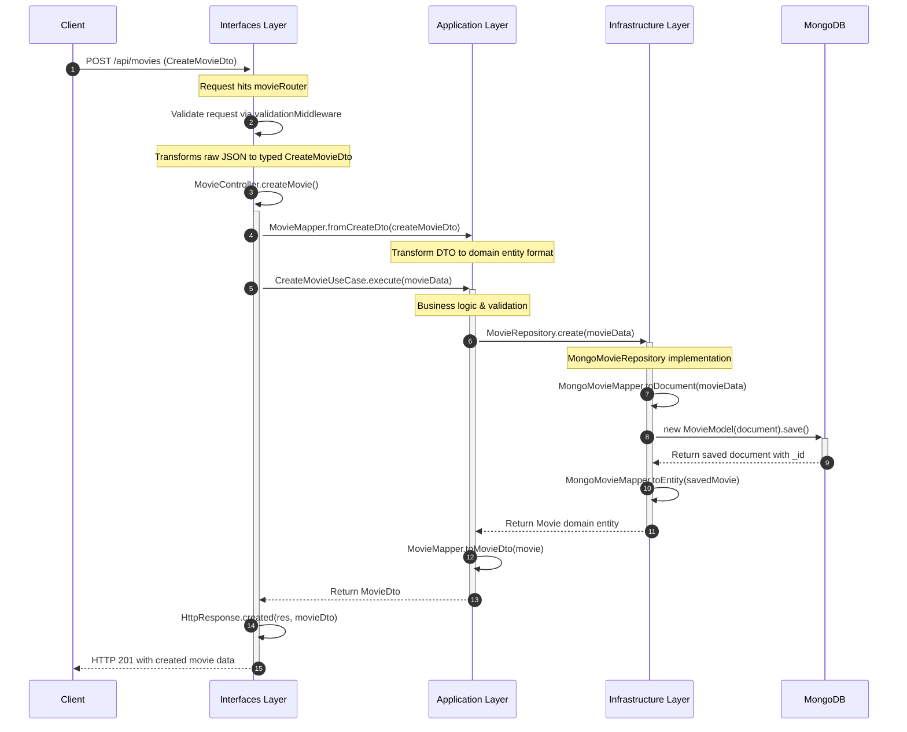
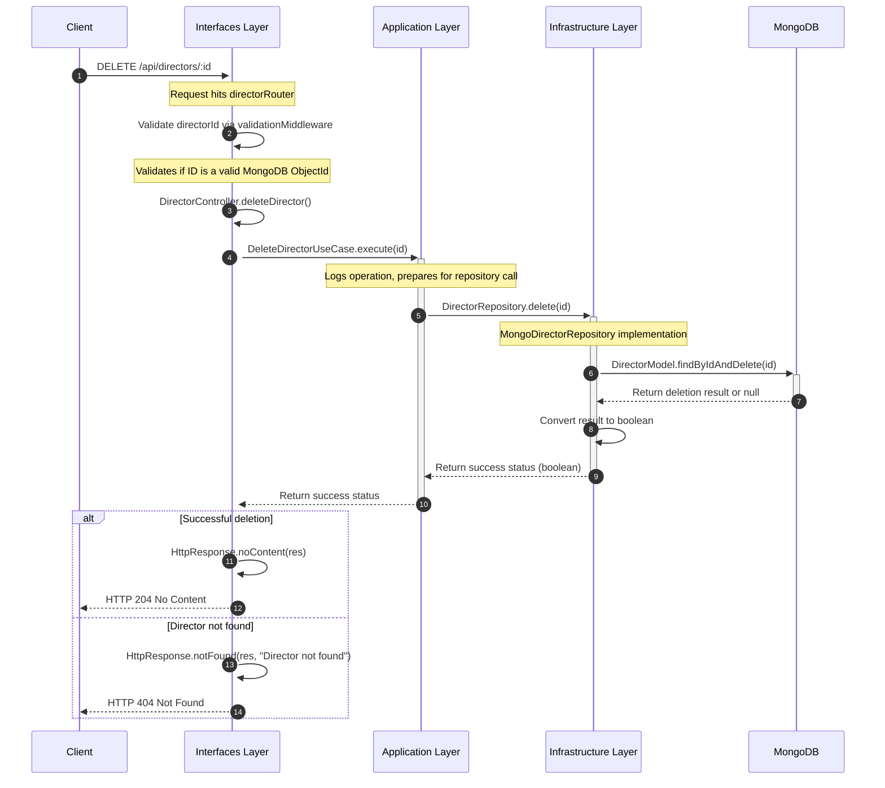

# Clean Movie API

A RESTful API for managing movies and directors built with Express.js, TypeScript, and MongoDB following Clean Architecture principles.

## Table of Contents

- [Description](#description)
- [Architecture](#architecture)
  - [Domain Layer](#domain-layer)
  - [Application Layer](#application-layer)
  - [Infrastructure Layer](#infrastructure-layer)
  - [Interfaces Layer](#interfaces-layer)
- [Project Structure](#project-structure)
- [API Endpoints](#api-endpoints)
- [Development Tools](#development-tools)
- [Getting Started](#getting-started)
  - [Prerequisites](#prerequisites)
  - [Installation](#installation)
  - [Environment Variables](#environment-variables)
- [Running the Application](#running-the-application)
  - [Development Mode](#development-mode)
  - [Docker Development](#docker-development)
  - [Production Mode](#production-mode)
- [Testing](#testing)
- [Caching](#caching)
- [Domain Workflows](#domain-workflows)

## Description

Clean Movie API is a robust backend service that allows users to manage a collection of movies and directors. The API provides endpoints for creating, reading, updating, and deleting movies and directors. It follows the Clean Architecture pattern to ensure separation of concerns, maintainability, and testability.

Key features include:

- RESTful API with standard CRUD operations
- Clean Architecture implementation
- MongoDB integration with Mongoose
- Type safety with TypeScript
- Dependency injection with TSyringe
- Comprehensive error handling
- Structured logging
- Caching support with Redis or in-memory fallback
- Comprehensive test coverage

## Architecture

This project implements the Clean Architecture pattern, organizing code into concentric layers with a clear separation of concerns. The dependencies flow inward, with inner layers having no knowledge of outer layers.

### Domain Layer

The core of the application, containing business entities and repository interfaces.

- **Entities**: Core business objects (Movie, Director)
- **Repositories**: Interface definitions for data access

### Application Layer

Contains application-specific business rules and use cases.

- **Use Cases**: Implementation of business operations (e.g., CreateMovieUseCase)
- **Services**: Utility services for the application (e.g., MovieMapper)
- **DTOs**: Data transfer objects for communication between layers

### Infrastructure Layer

Implements interfaces defined in the domain layer and provides technical capabilities.

- **Repositories**: Concrete implementations of repository interfaces
- **Persistence**: Database schemas and models
- **Mappers**: Map between domain entities and database models
- **Logger**: Logging infrastructure
- **Cache**: Caching mechanisms
- **Config**: Environment configuration
- **DI**: Dependency injection setup

### Interfaces Layer

The outermost layer that interacts with external systems.

- **Controllers**: Handle HTTP requests and responses
- **Routes**: Define API endpoints
- **DTOs**: Define request and response structures
- **Middleware**: HTTP request processing middleware
- **Validation**: Input validation logic

## Project Structure

```
src/
├── domain/                # Domain Layer
│   ├── entities/          # Business entities
│   └── repositories/      # Repository interfaces
│
├── application/           # Application Layer
│   ├── services/          # Business services
│   └── use-cases/         # Business use cases
│       ├── movie/
│       └── director/
│
├── infrastructure/        # Infrastructure Layer
│   ├── cache/             # Caching implementation
│   ├── config/            # Application configuration
│   ├── di/                # Dependency injection setup
│   ├── logger/            # Logging infrastructure
│   ├── mappers/           # ORM to entity mappers
│   ├── persistence/       # Database schemas and connection
│   └── repositories/      # Repository implementations
│
├── interfaces/            # Interfaces Layer
│   ├── constants/         # API constants
│   ├── dtos/              # Data Transfer Objects
│   │   ├── request/       # Request DTOs
│   │   └── response/      # Response DTOs
│   └── http/              # HTTP-specific code
│       ├── controllers/   # API controllers
│       ├── middlewares/   # HTTP middlewares
│       ├── response/      # Response handling
│       ├── routes/        # API routes
│       └── validation/    # Request validation
│
├── main/                  # Application bootstrap
├── server.ts              # Entry point
└── shared/                # Shared utilities
    └── utils/             # Utility functions
```

## API Endpoints

### Movies

- **GET** `/api/movies` - Get all movies with filtering, pagination, and sorting
- **GET** `/api/movies/:id` - Get a movie by ID
- **POST** `/api/movies` - Create a new movie
- **PUT** `/api/movies/:id` - Update an existing movie
- **DELETE** `/api/movies/:id` - Delete a movie

### Directors

- **POST** `/api/directors` - Create a new director
- **DELETE** `/api/directors/:id` - Delete a director

## Development Tools

### Code Quality & Style

- **ESLint**: Enforces code quality and style rules, with TypeScript-specific configurations
- **Prettier**: Code formatter integrated with ESLint for consistent code style

### Git Workflow

- **Commitlint**: Enforces conventional commit message format to improve repository history readability
- **Husky**: Manages Git hooks to automate tasks before commits and pushes
  - Pre-commit: Runs lint-staged and TypeScript checks
  - Commit-msg: Validates commit messages using commitlint
  - Prepare-commit-msg: Helps with generating conventional commits

## Getting Started

### Prerequisites

- Node.js (v16 or later)
- MongoDB
- Redis (optional, for caching)
- Docker and Docker Compose (optional, for containerized development)

### Installation

1. Clone the repository

   ```bash
   git clone https://github.com/remidosol/express-ts-clean-movie-api.git
   cd express-ts-clean-movie-api
   ```

2. Install dependencies

   ```bash
   yarn install
   ```

### Environment Variables

Create a `.env` file in the project root with the following variables:

```env
# Application
PORT=3000
APP_NAME=clean-movie-api
NODE_ENV=development

# Database
MONGODB_URI=mongodb://localhost:27017/movie-api

# Cache
CACHE_TTL=3600000  # 1 hour in milliseconds

# Redis (optional)
REDIS_HOST=localhost
REDIS_PORT=6379
REDIS_USERNAME=
REDIS_PASSWORD=
REDIS_DB=0
```

## Running the Application

### Development Mode

```bash
yarn start:dev
```

### Docker Development

The project includes Docker configuration for easy development setup:

```bash
# Start the development environment with MongoDB and Redis
docker-compose -f docker-compose.dev.yml up

# Run only specific services
docker-compose -f docker-compose.dev.yml up mongodb redis
```

This will set up:

- MongoDB container (accessible on port 27018)
- Redis container (accessible on port 6379)
- Express backend container with hot reloading (accessible on port 3333)

### Production Mode

```bash
yarn build
yarn start:prod
```

## Testing

```bash
# Run all tests
yarn test

# Run unit tests
yarn test:unit

# Run integration tests
yarn test:integration

# Generate coverage report
yarn test:cov
```

## Caching

The API includes a caching layer that can use either Redis or in-memory storage. If Redis credentials are provided in the environment variables, the system will use Redis. Otherwise, it falls back to in-memory caching.

## Domain Workflows

This section visualizes how requests flow through our Clean Architecture implementation, demonstrating the separation of concerns and the interaction between layers.

### Create Movie Workflow

The following sequence diagram shows the flow of a request to create a new movie through the POST /api/movies endpoint.



This workflow demonstrates how:

1. The request passes through validation in the Interfaces layer
2. The controller delegates to the application layer's use case
3. The use case executes the business logic and coordinates with the Infrastructure layer
4. The infrastructure layer handles database operations
5. The response flows back through the layers, with each layer applying appropriate transformations

### Delete Director Workflow

The following sequence diagram shows the flow of a request to delete a director through the DELETE /api/directors/:id endpoint.



This workflow highlights:

1. Parameter validation ensures the ID is in the correct format
2. The controller delegates to the use case without handling business logic
3. The application layer coordinates the deletion operation
4. The infrastructure layer implements the actual database operation
5. The response follows REST conventions based on the operation result

These workflows maintain the Clean Architecture principles by ensuring:

- Each layer has a single responsibility
- Dependencies point inward (toward the domain core)
- The domain models and interfaces guide the implementation
- External concerns (like HTTP and database) are kept at the outer layers

## Integration with Architectural Layers

The Main module integrates all architectural layers of the application:

**Layer Relationships:**

- **Main Module**
  - Orchestrates the entire application
  - ↓
- **Interfaces Layer**
  - Handles HTTP requests/responses
  - Controllers, Routes, Middleware
  - ↓
- **Application Layer**
  - Implements business use cases
  - Orchestrates domain objects using repository interfaces
  - ↓
- **Domain Layer**
  - Core business entities and rules
  - Repository interfaces (contracts)
  - ↑
- **Infrastructure Layer**
  - Implements repository interfaces
  - Provides technical capabilities
  - Connects to external services
